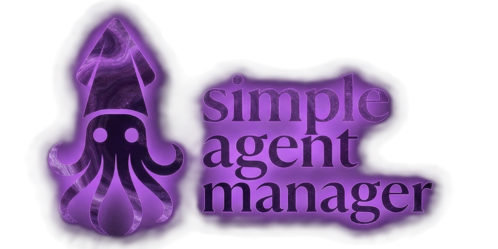

# 🦑 Simple Agent Manager - Node Based Agent Builder



A node-based graphical interface for building and managing custom AI agents. Drag-and-drop nodes onto a canvas to visually configure agents with memory, tools, context engines, databases, and more -- then chat with them directly from the dashboard.

Built with React 19, TypeScript, and [@xyflow/react](https://reactflow.dev/) for the graph editor, powered by [pi-agent-core](https://github.com/nicepkg/pi-mono) for the agent runtime.

## Features

- **Visual Agent Builder** -- Drag agent and peripheral nodes onto a canvas, connect them with edges to define agent capabilities
- **OpenClaw-Inspired Architecture** -- Memory, tools, and context engine nodes modeled after [OpenClaw](https://docs.openclaw.ai/) concepts
- **Decoupled Runtime** -- Agent configs are serializable JSON; the runtime layer has no React dependency and can conceptually run headless
- **Multi-Provider LLM Support** -- Anthropic, OpenAI, OpenRouter, Google, Ollama, Mistral, Groq, xAI
- **Memory Engine** -- Multiple backends (builtin/external/cloud), compaction strategies (summary/sliding-window/hybrid), memory tools (search/get/save) exposed to agents
- **Tool System** -- Profiles (full/coding/messaging/minimal), groups (runtime/fs/web/memory/coding/communication), skills (markdown instructions), plugins
- **Context Engine** -- Token budget management, compaction lifecycle (assemble/compact/afterTurn), RAG integration, system prompt additions
- **Settings Modal** -- API key management per provider, stored in localStorage
- **Export/Import** -- Export graphs as JSON bundles, import from file, load pre-built test fixtures
- **Dark Theme** -- Tailwind CSS dark UI throughout

## Node Types

| Node | Description |
|------|-------------|
| **Agent** | Central hub node -- LLM provider, model, system prompt, thinking level |
| **Memory** | How the agent remembers -- backends, compaction, memory tools |
| **Tools** | Agent capabilities -- tool profiles, groups, skills, plugins |
| **Skills** | Standalone skill definitions injected into the system prompt |
| **Context Engine** | Context management -- token budget, compaction, RAG |
| **Agent Comm** | Inter-agent communication (direct/broadcast) |
| **Connectors** | External service connectors (REST API, etc.) |
| **Database** | Data storage (PostgreSQL, MySQL, SQLite, MongoDB, IndexedDB, REST API) |
| **Vector Database** | Vector storage (Pinecone, ChromaDB, Qdrant, Weaviate) |

## Getting Started

### Prerequisites

- Node.js 18+
- npm

### Install & Run

```bash
npm install
npm run dev
```

Open [http://localhost:5173](http://localhost:5173) in your browser.

### Build

```bash
npm run build
```

Output is in `dist/`.

### Usage

1. **Configure API keys** -- Click the gear icon (top-right) to open Settings and enter your provider API keys
2. **Create an agent** -- Drag an "Agent" node onto the canvas from the left sidebar
3. **Add peripherals** -- Drag Memory, Tools, Context Engine, or Database nodes and connect them to the agent
4. **Customize** -- Click any node to open the properties panel on the right and configure it
5. **Chat** -- Click the "Chat" button on an agent node to open the chat drawer and start a conversation
6. **Export/Import** -- Use the sidebar action buttons to export your graph, import one, or load the built-in test fixture

## Architecture

```
Graph (React Flow nodes/edges)
  -> resolveAgentConfig()  -->  AgentConfig (serializable JSON)
    -> AgentRuntime             (wraps pi-agent-core Agent, no React dependency)
      -> MemoryEngine           (backends, compaction, memory tools)
      -> ContextEngine          (assemble/compact lifecycle, token budget)
      -> ToolFactory            (profiles, groups -> AgentTool instances)
        -> ChatDrawer           (subscribes to runtime events)
```

**Config Layer** -- Node data types and graph traversal produce a serializable `AgentConfig` (pure JSON).

**Runtime Layer** -- `AgentRuntime` takes an `AgentConfig` + API key resolver, creates a real `pi-agent-core` Agent with tools, memory, and context management. No React dependency.

**UI Layer** -- React components subscribe to `AgentRuntime` events for streaming updates, tool call displays, and status indicators.

## Tech Stack

- **React 19** + TypeScript + Vite 6
- **@xyflow/react 12** -- Node-based graph editor
- **@mariozechner/pi-ai** -- Unified LLM API (stream, getModel, KnownProvider)
- **@mariozechner/pi-agent-core** -- Agent class with tools, transformContext, event subscription
- **Zustand 5** -- State management
- **Tailwind CSS 4** -- Styling
- **@sinclair/typebox** -- Tool parameter schemas
- **lucide-react** -- Icons

## Project Structure

```
src/
  canvas/          Flow canvas and drag-and-drop
  chat/            Chat drawer and agent runner hook
  edges/           Custom edge components
  fixtures/        Test graph fixtures
  nodes/           Node components (Agent, Memory, Tools, etc.)
  panels/          Sidebar, properties panel, property editors
  runtime/         Agent runtime (config, runtime, memory, context, tools)
  settings/        API key management
  store/           Zustand stores (graph, runtime, storage)
  types/           TypeScript types (nodes, graph)
  utils/           Utilities (theme, defaults, export/import, IDs)
```

## License

MIT
